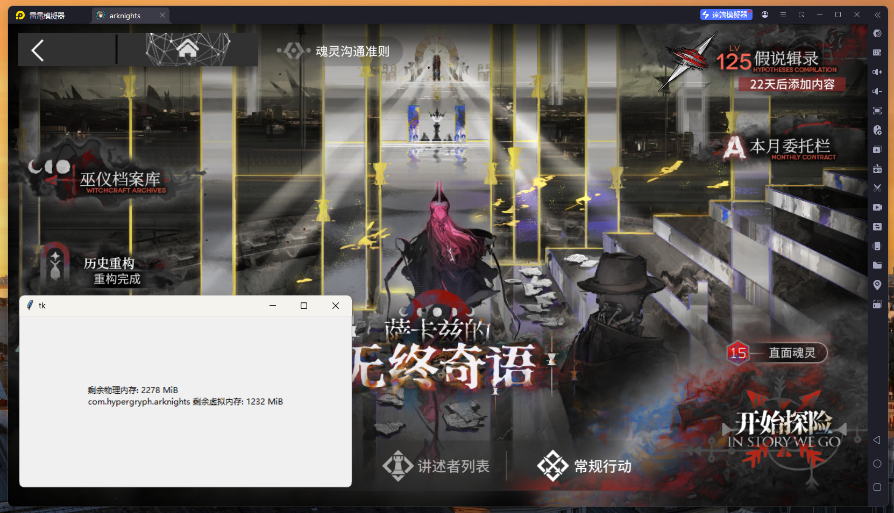
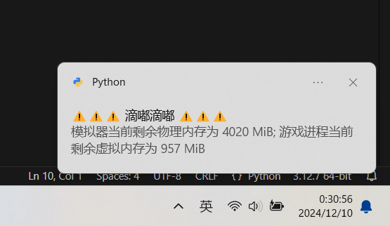

# 明日方舟苦尽甘来警报器

检测模拟器中明日方舟的内存占用, 在模拟器物理内存/游戏进程虚拟内存耗竭前发送通知, 避免苦尽甘来.

## 使用方法

1. 开启模拟器的adb连接. 支持的模拟器: MUMU, LD

2. `pip install -r requirements.txt`; 执行`main.py` (或者执行github action生成的二进制main.exe)

3. 在游戏运行过程中, 保持本工具的开启. 本工具将自动周期获取模拟器的内存使用情况. 当内存不足时, 本工具使用windows的通知给出警告.

## 截图

警告示意图 (实际警戒线为 300 MiB):

